# Mermaid Diagram Examples

Ready-to-use templates tailored to Angular frontend applications.

---

## 1. Flowchart — Form Submission Flow

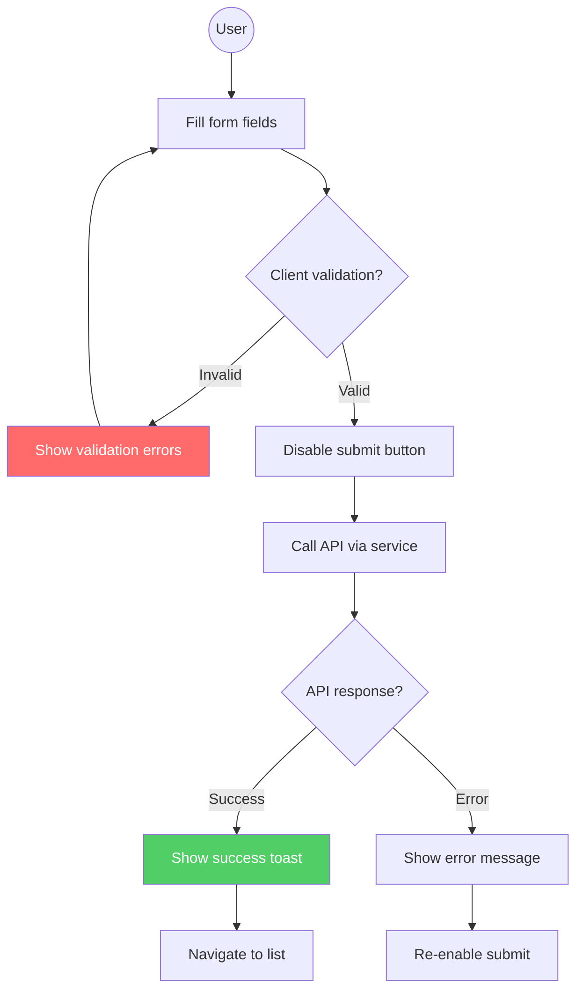

---

## 2. Sequence Diagram — JWT Authentication Flow

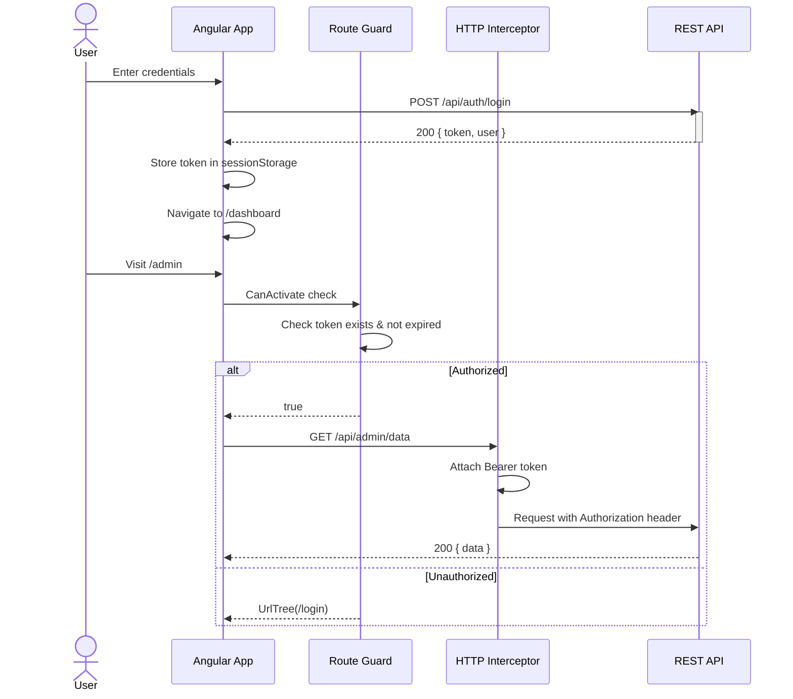

---

## 3. Sequence Diagram — HTTP Interceptor Chain

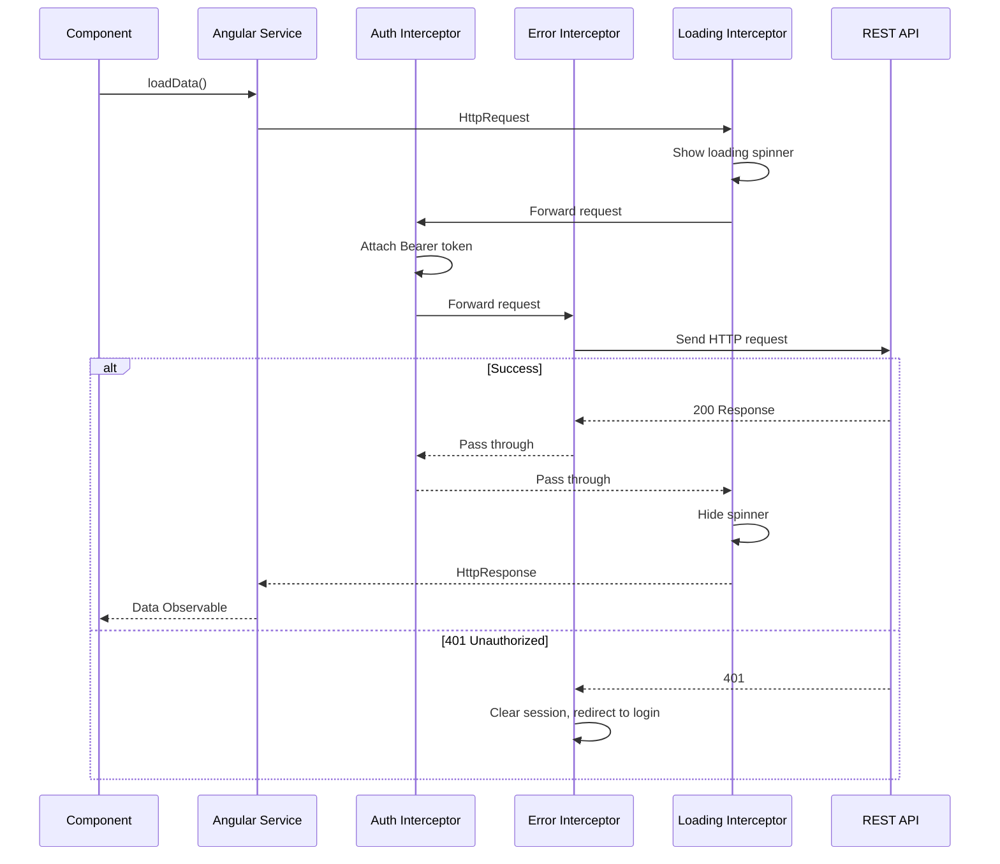

---

## 4. Class Diagram — Angular Service Architecture

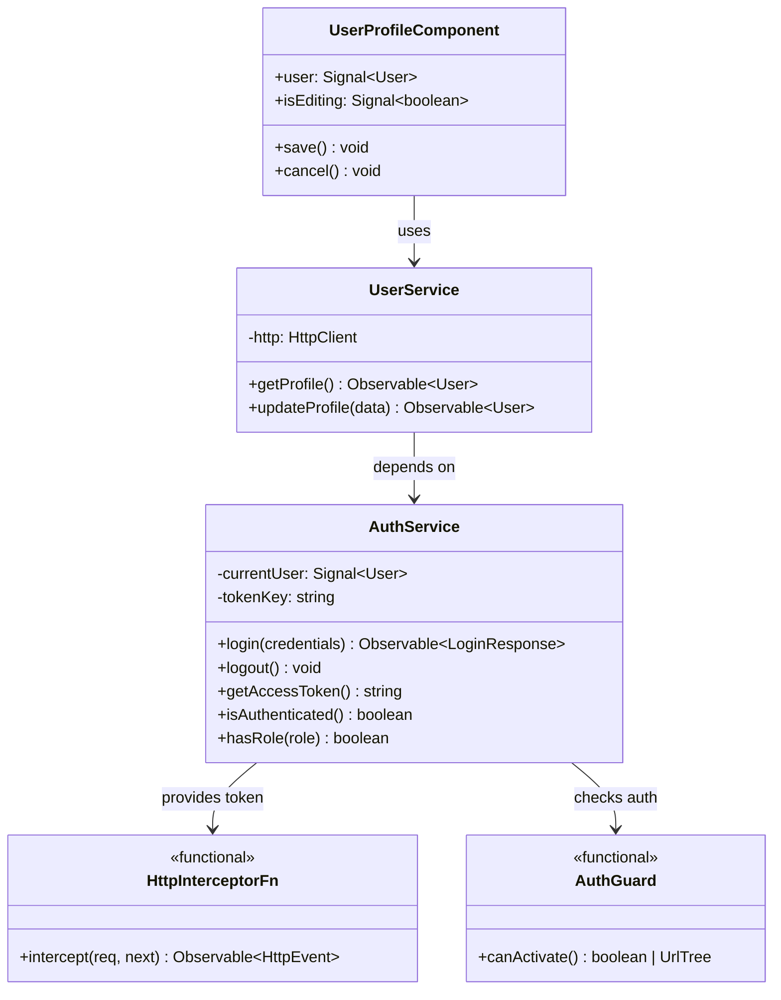

---

## 5. State Diagram — Authentication State Machine

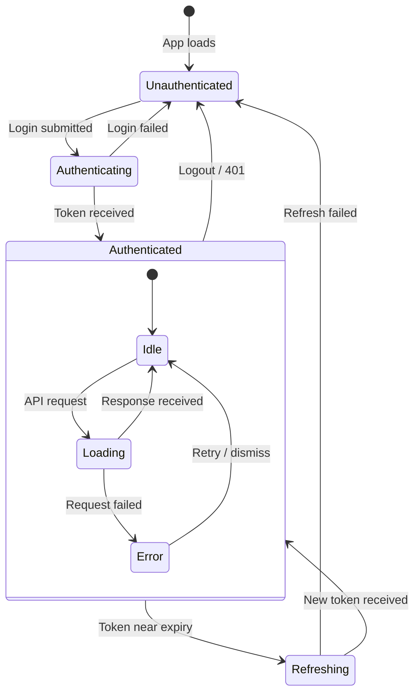

---

## 6. Flowchart — Lazy Loading Route Resolution

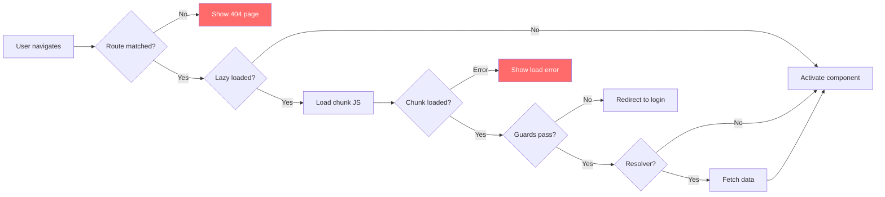

---

## 7. Flowchart — Global Error Handling Architecture

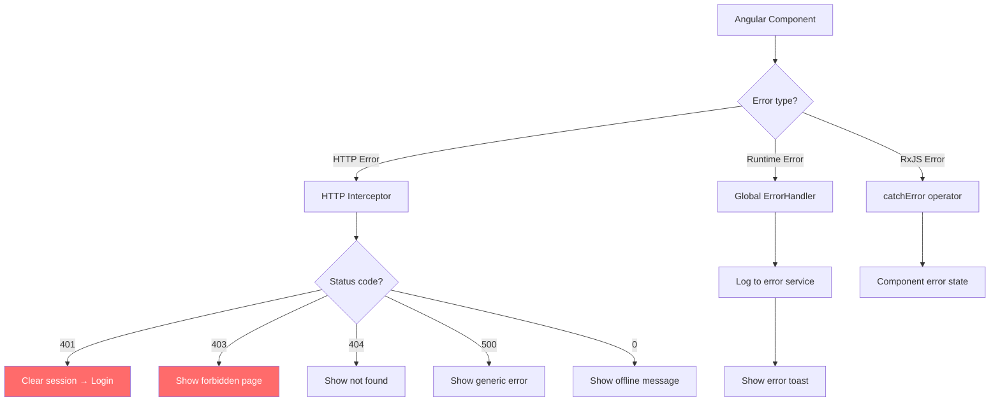

---

## 8. ER Diagram — Application Data Model

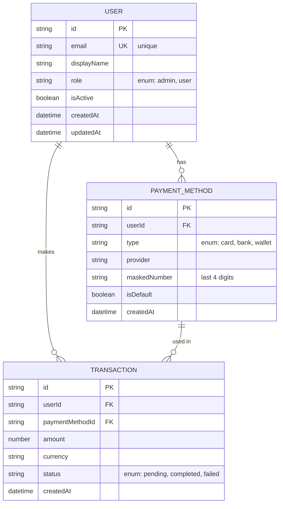

---

## 9. Flowchart — Reactive Form Validation

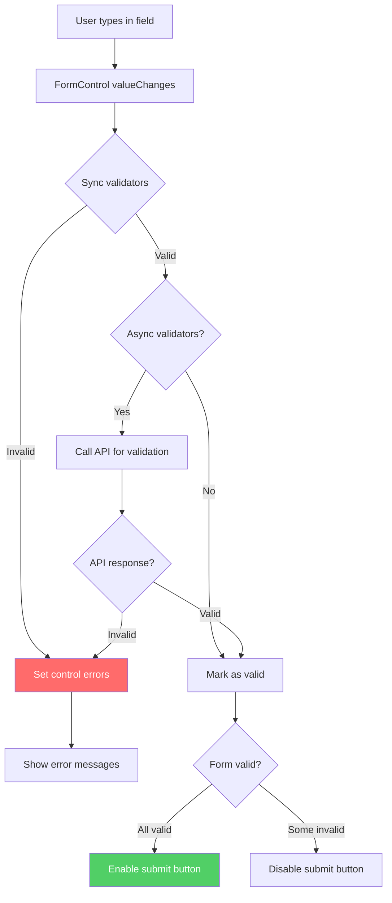

---

## 10. Gantt Chart — Feature Implementation Plan

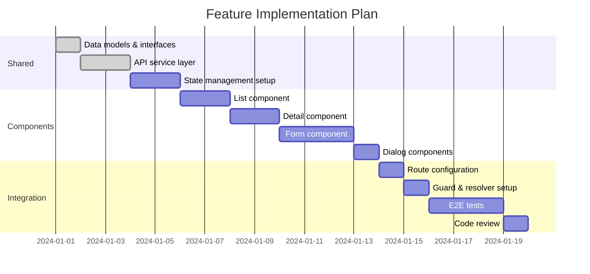

---

## 11. Mindmap — Angular Application Architecture

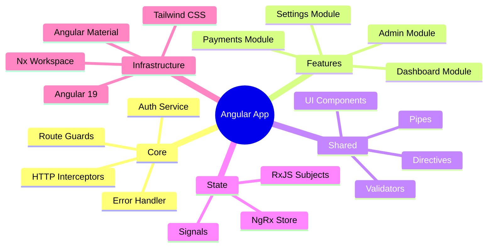

---

## 12. Sequence Diagram — Component Communication via Service

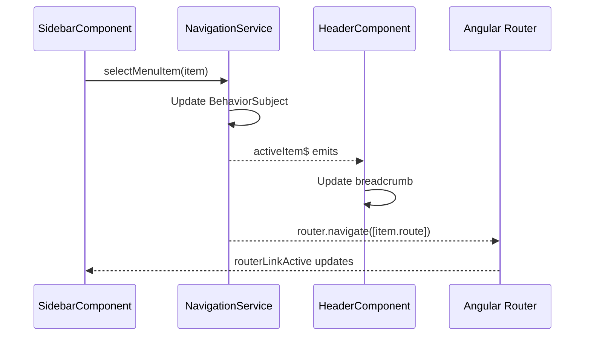
